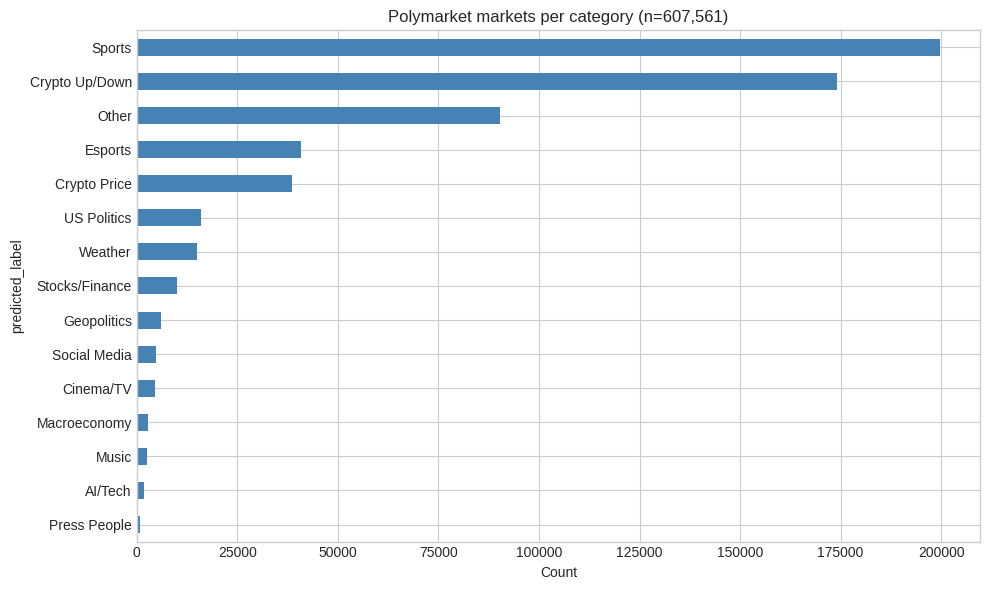
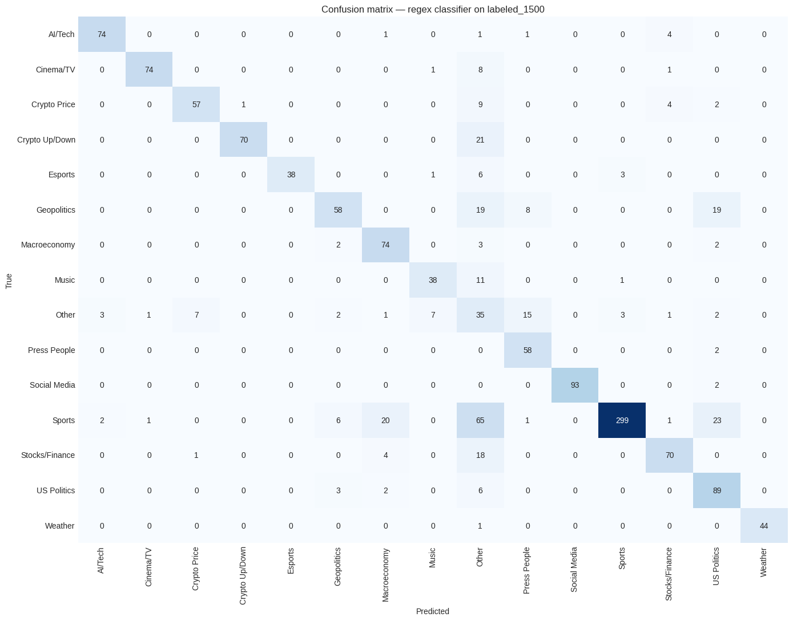

# Polymarket comme Indicateur Avancé des Marchés Financiers

> **Démonstration que la foule Polymarket — chaque pari engage de l'argent réel —
> agrège l'information plus vite et mieux que les indicateurs traditionnels,
> et que ses mouvements précèdent ceux des marchés financiers sur les
> événements macro.**

> 🔄 **Work in Progress** — projet de recherche en cours.
> Phases 1, 2 et 5a complétées · Phase 5b démarre



---

## 🎯 Objectif

Prouver empiriquement deux choses complémentaires :

1. **Qualité de la foule** — Polymarket est mieux calibré que les indicateurs
   traditionnels : sondages Bloomberg, consensus des économistes, Fear & Greed
   Index, probabilités implicites des options.
2. **Lead sur les marchés financiers** — les variations de prix Polymarket
   anticipent les mouvements des assets financiers autour des événements macro
   (Fed, CPI, NFP, élections, géopolitique).

**Livrable final visé** :

> *"Sur les 50 dernières décisions de la Fed, Polymarket avait le bon outcome
> à J-7 dans X% des cas, contre Y% pour le consensus Bloomberg. Dans les cas
> où Polymarket divergeait fortement du consensus, les marchés obligataires
> bougeaient en moyenne de Z% dans le sens Polymarket."*

---

## 🗺️ Progression

| Phase | Statut | Livrable |
|---|---|---|
| **1** — Concepts & scanner | ✅ | 561 marchés macro/finance identifiés |
| **2** — Collecte données | ✅ | 607K markets + 14 tickers + 418M trades sur BigQuery |
| **5a** — Classification 15 catégories | ✅ | F1 macro **0.81** — notebook + table `markets_classified` |
| **5b** — Alignement temporel | 🔄 | Merge Polymarket × yfinance sur 2 ans hourly |
| **5c** — Stats : Brier + Granger + cross-correlation | ⏭ | Chiffres principaux de la thèse |
| **5d** — Dashboard final | ⏭ | Visualisations hero pour publication |
| **5e** — Publication | ⏭ | Article Substack + posts LinkedIn / X |
| 3 — Trading (auth L1/L2) | 💤 | Hors scope actuel |
| 4 — Onchain (CTF, MM) | 💤 | Hors scope actuel |

---

## 📊 Résultats actuels

### Phase 5a — Classification des 607 561 markets ✅

Objectif : segmenter tous les markets Polymarket en 15 catégories thématiques
pour permettre l'analyse par domaine dans les phases suivantes.

- **Méthode** — regex publiées par Le, N.A. (2026). *Decomposing Crowd Wisdom*
  ([arXiv:2602.19520](https://arxiv.org/abs/2602.19520), MIT license), étendues
  avec des patterns custom pour les catégories absentes du papier (AI/Tech,
  Weather, Cinema/TV, Music, Press People, Social Media, Esports, tickers
  boursiers).
- **Validation** — F1 macro **0.81** sur `labeled_1500.csv`
  (1 500 markets hand-labeled équilibrés sur les 15 catégories).
- **Sortie** — table BigQuery `polymarket-research-490517.polymarket.markets_classified`.

**Distribution des catégories sur les 607K markets** :

| Catégorie | # markets | % |
|---|---:|---:|
| Sports | 199 651 | 32.9% |
| Crypto Up/Down (sub-hourly) | 174 185 | 28.7% |
| Other | 90 290 | 14.9% |
| Esports | 40 754 | 6.7% |
| Crypto Price | 38 550 | 6.3% |
| US Politics | 15 943 | 2.6% |
| Weather | 14 922 | 2.5% |
| Stocks/Finance | 9 952 | 1.6% |
| Geopolitics | 6 028 | 1.0% |
| Social Media, Cinema/TV, Macroeconomy, Music, AI/Tech, Press People | < 1% chacun | — |

**Matrice de confusion sur la validation** :



### Phases 5b / 5c — À venir

- Brier Score Polymarket vs consensus Bloomberg sur les N dernières décisions Fed
- Heatmap de causalité Granger : Polymarket → assets financiers (SPY, DXY, ZN, GLD, BTC-USD)
- Cross-correlation à différents lags (+1h, +1j, +1sem)
- Quantification du lead moyen en heures/jours

---

## 🧠 Thèse

Polymarket est un thermomètre du sentiment collectif suffisamment fiable pour
anticiper les mouvements des marchés financiers. Chaque participant met de
l'argent réel — ce qui filtre les opinions non-réfléchies et force l'honnêteté.

Ce n'est pas un projet de causalité technique pure. C'est une démonstration en
deux parties :

1. **Preuve de la qualité de la foule** — Polymarket est mieux calibré
   historiquement que les indicateurs traditionnels.
2. **Corrélation avec les marchés financiers** — les mouvements du sentiment
   Polymarket coïncident avec (et précèdent souvent) les mouvements des assets
   financiers autour des événements macro.

---

## 🛠️ Stack technique

- **Python 3.12** — langage principal
- **APIs Polymarket** — Gamma API (discovery) / CLOB API (prix, orderbook) / Data API (trades)
- **yfinance** — données marchés financiers (SPY, BTC, GLD, DXY, VIX, ZN, etc.)
- **Google Cloud** — BigQuery + GCS + Colab notebooks
- **pandas, numpy, statsmodels** — analyse quantitative
- **matplotlib, seaborn, plotly** — visualisation
- **scikit-learn** — validation des classifieurs
- **py-clob-client, web3.py** — interactions blockchain Polygon (phases 3/4, hors scope actuel)

---

## 📁 Structure du projet

```
├── phase-1-concepts/        ← Scanner des marchés macro / finance
├── phase-2-market-data/     ← Pipeline de collecte (Gamma, CLOB, yfinance)
├── phase-5-research/        ← Scripts d'analyse statistique
├── notebooks/               ← Analyses Colab + BigQuery
│   ├── 01_market_selection.ipynb
│   ├── 02_crowd_calibration.ipynb
│   ├── 03_sentiment_vs_markets.ipynb
│   └── 04_classification.ipynb       ← phase 5a ✅
├── outputs/                 ← Figures exportées par phase
├── data/                    ← Données locales (gitignored)
└── deprecated/              ← Approches abandonnées conservées pour traçabilité
```

---

## 🚀 Installation

```bash
git clone https://github.com/Pennywis404/wisdom_prediction.git
cd wisdom_prediction

python3 -m venv venv
source venv/bin/activate
pip install -r requirements.txt

cp .env.example .env
# Éditer .env avec vos clés (Polygon, Google Cloud…)
```

Les notebooks tournent sur Google Colab (authentification BigQuery via
`google.colab.auth`).

---

## 📚 References

- **Paper de référence** — Le, N.A. (2026). *Decomposing Crowd Wisdom:
  Domain-Specific Calibration Dynamics in Prediction Markets*.
  [arXiv:2602.19520](https://arxiv.org/abs/2602.19520).
  Repo MIT : [namanhz/prediction-market-calibration](https://github.com/namanhz/prediction-market-calibration)
- **Dataset trades** — [SII-WANGZJ/Polymarket_data](https://huggingface.co/datasets/SII-WANGZJ/Polymarket_data)
  (1.1 milliard de trades extraits de la blockchain Polygon)
- **Documentation Polymarket** — [docs.polymarket.com](https://docs.polymarket.com)
- **Oracle UMA** — [oracle.uma.xyz](https://oracle.uma.xyz) (résolution des markets)

---

*Projet mené par Théo Ollier — en apprentissage, basé à Nice. Contact via
[LinkedIn](https://www.linkedin.com/) ou issues GitHub.*
