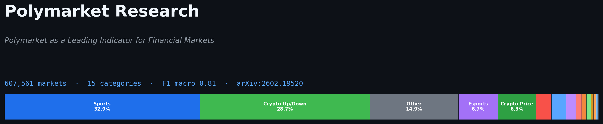
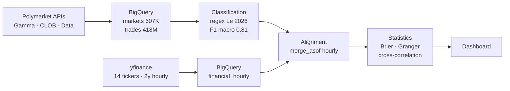

# Polymarket comme Indicateur Avancé des Marchés Financiers




> **Tester si la foule Polymarket — chaque pari engage de l'argent réel — anticipe
> les mouvements des marchés financiers autour des événements macro.**

## Hypothèses testées

1. La foule Polymarket est mieux calibrée que les indicateurs traditionnels
   (sondages Bloomberg, consensus des économistes, Fear & Greed Index) parce
   que chaque participant met de l'argent réel.
2. Les mouvements de prix Polymarket anticipent ceux des marchés financiers
   autour des événements macro (Fed, CPI, NFP, élections, géopolitique).

Livrable visé : une comparaison chiffrée du type *"sur les N dernières décisions
de la Fed, Polymarket avait le bon outcome à J-7 dans X% des cas, contre Y%
pour le consensus Bloomberg"*.

## Méthode

Pipeline global :



Détail par phase :

- **Phase 2** — ingestion via Gamma / CLOB / Data API + dataset
  [SII-WANGZJ/Polymarket_data](https://huggingface.co/datasets/SII-WANGZJ/Polymarket_data)
  (1.1 milliard de trades extraits de Polygon).
- **Phase 5a** — classification via les regex publiées avec Le, N.A. (2026),
  *Decomposing Crowd Wisdom* ([arXiv:2602.19520](https://arxiv.org/abs/2602.19520),
  licence MIT), étendues avec des patterns custom pour les catégories
  absentes du papier (AI/Tech, Weather, Cinema/TV, Music, Press People,
  Social Media, Esports, tickers boursiers). Validation sur 1 500 markets
  hand-labellisés → F1 macro **0.81**.
- **Phase 5b** — alignement temporel Polymarket × yfinance via `merge_asof`
  au pas horaire sur 2 ans.
- **Phase 5c** — calcul du Brier Score Polymarket vs consensus Bloomberg,
  test de causalité Granger à plusieurs lags (+1h, +1j, +1sem),
  cross-correlation.

## Résultats actuels

### Phase 5a — Classification des 607 561 markets (terminée)

Segmenter tous les markets Polymarket en 15 catégories thématiques pour
permettre l'analyse par domaine dans les phases suivantes. Sortie dans la table
BigQuery `polymarket-research-490517.polymarket.markets_classified`.

Validation sur `labeled_1500.csv` (1 500 markets hand-labellisés, équilibrés
sur les 15 catégories) — matrice de confusion :


<details>
<summary><b>Distribution détaillée des 15 catégories</b> (cliquer pour déplier)</summary>

| Catégorie | markets | % |
|:---|---:|---:|
| Sports | 199 651 | 32.9 |
| Crypto Up/Down | 174 185 | 28.7 |
| Other | 90 290 | 14.9 |
| Esports | 40 754 | 6.7 |
| Crypto Price | 38 550 | 6.3 |
| US Politics | 15 943 | 2.6 |
| Weather | 14 922 | 2.5 |
| Stocks/Finance | 9 952 | 1.6 |
| Geopolitics | 6 028 | 1.0 |
| Social Media | 4 710 | 0.8 |
| Cinema/TV | 4 624 | 0.8 |
| Macroeconomy | 2 730 | 0.4 |
| Music | 2 579 | 0.4 |
| AI/Tech | 1 749 | 0.3 |
| Press People | 894 | 0.1 |

Détails et code : [`notebooks/04_classification.ipynb`](notebooks/04_classification.ipynb).

</details>

### Phases 5b et 5c — à venir

- Brier Score Polymarket vs consensus Bloomberg sur les dernières Fed decisions
- Tests de causalité Granger : Polymarket → SPY, DXY, ZN, GLD, BTC-USD
- Cross-correlation à différents lags (+1h, +1j, +1sem)

## Roadmap

| Phase | Statut | Livrable |
|:---|:---|:---|
| 1 — Concepts & scanner | fait | 561 marchés macro / finance identifiés |
| 2 — Collecte données | fait | 607K markets, 14 tickers, 418M trades sur BigQuery |
| 5a — Classification 15 catégories | fait | F1 macro 0.81, table `markets_classified` |
| 5b — Alignement Polymarket × yfinance | en cours | Données alignées hourly sur 2 ans |
| 5c — Stats : Brier + Granger + cross-correlation | à faire | Chiffres principaux |
| 5d — Dashboard final | à faire | Visualisations de publication |
| 5e — Écriture / publication | à faire | Article + posts |

Les phases 3 (trading L1/L2) et 4 (onchain CTF) sont hors scope actuel.

## Reproduire

<details>
<summary><b>Stack technique</b></summary>

- Python 3.12
- APIs Polymarket : Gamma (discovery), CLOB (prix, orderbook), Data (trades)
- yfinance pour les tickers financiers
- Google Cloud : BigQuery + Colab notebooks
- pandas, numpy, statsmodels, scikit-learn
- matplotlib, seaborn

</details>

<details>
<summary><b>Arborescence du repo</b></summary>

```
├── phase-1-concepts/        Scanner des marchés macro / finance
├── phase-2-market-data/     Pipeline de collecte (Gamma, CLOB, yfinance)
├── phase-5-research/        Scripts d'analyse statistique
├── notebooks/               Analyses Colab + BigQuery
│   ├── 01_market_selection.ipynb
│   ├── 02_crowd_calibration.ipynb
│   ├── 03_sentiment_vs_markets.ipynb
│   └── 04_classification.ipynb
├── outputs/                 Figures exportées
├── data/                    Données locales (gitignored)
└── deprecated/              Approches abandonnées (traçabilité)
```

</details>

<details>
<summary><b>Installation</b></summary>

```bash
git clone https://github.com/Pennywis404/wisdom_prediction.git
cd wisdom_prediction

python3 -m venv venv
source venv/bin/activate
pip install -r requirements.txt

cp .env.example .env
# Éditer .env avec les clés nécessaires
```

Les notebooks tournent sur Google Colab (authentification BigQuery via
`google.colab.auth`).

</details>

## References

- Le, N.A. (2026). *Decomposing Crowd Wisdom: Domain-Specific Calibration
  Dynamics in Prediction Markets.* [arXiv:2602.19520](https://arxiv.org/abs/2602.19520).
  Code : [namanhz/prediction-market-calibration](https://github.com/namanhz/prediction-market-calibration) (MIT).
- Dataset trades : [SII-WANGZJ/Polymarket_data](https://huggingface.co/datasets/SII-WANGZJ/Polymarket_data)
  (1.1 milliard de trades extraits de Polygon).
- Documentation Polymarket : [docs.polymarket.com](https://docs.polymarket.com).
